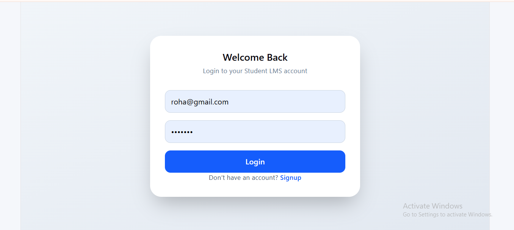
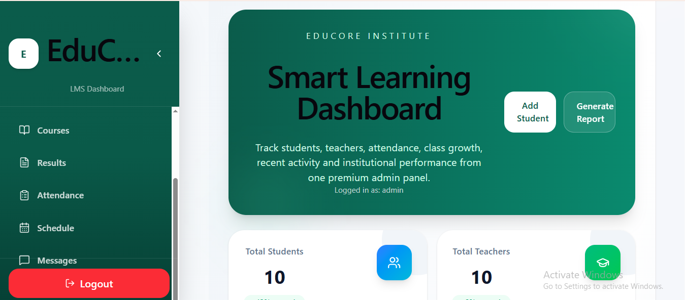
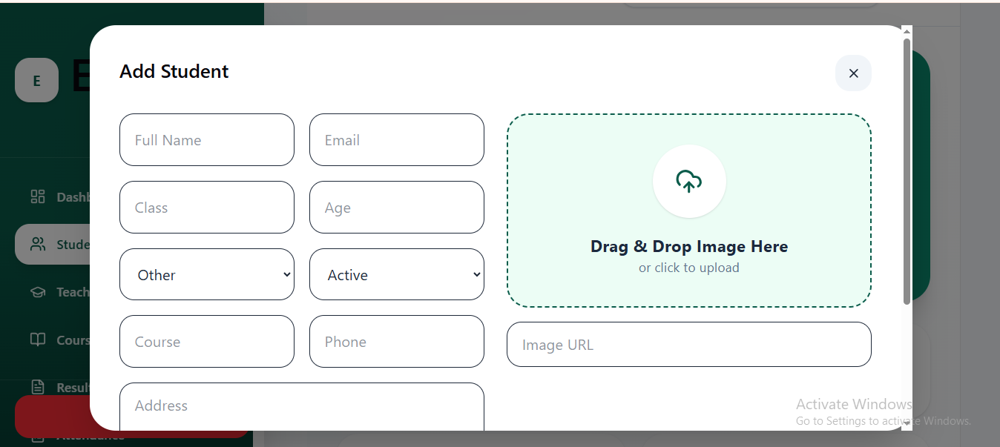
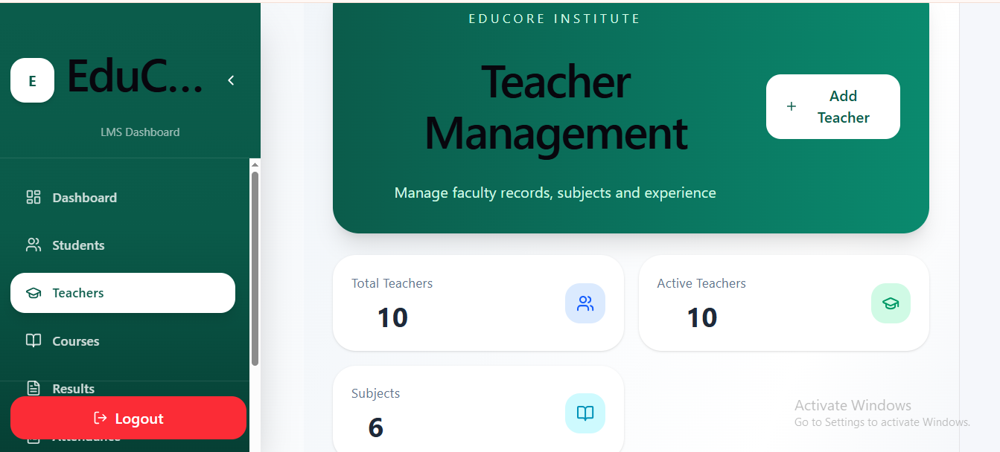
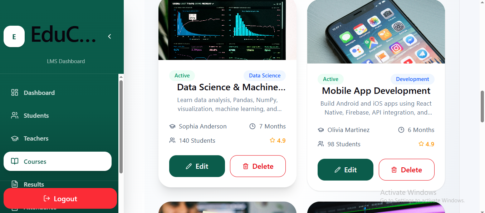
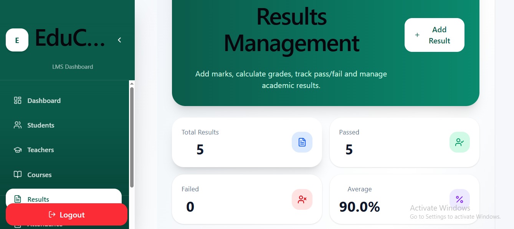
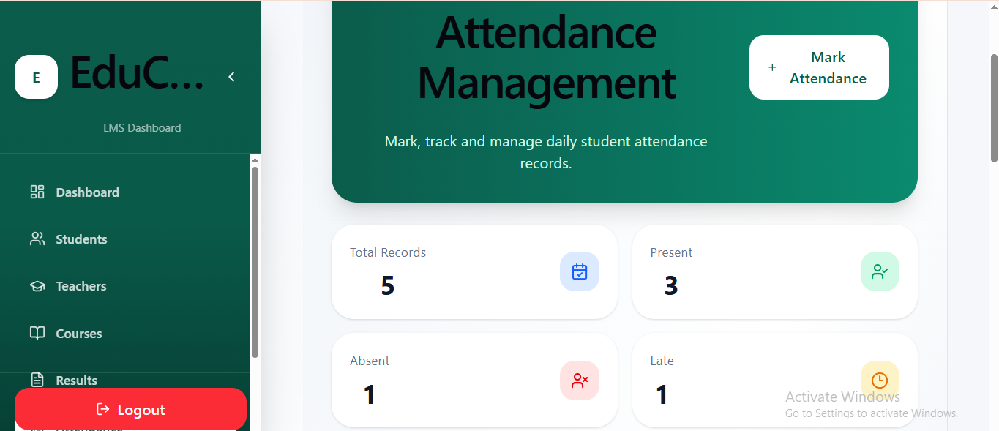
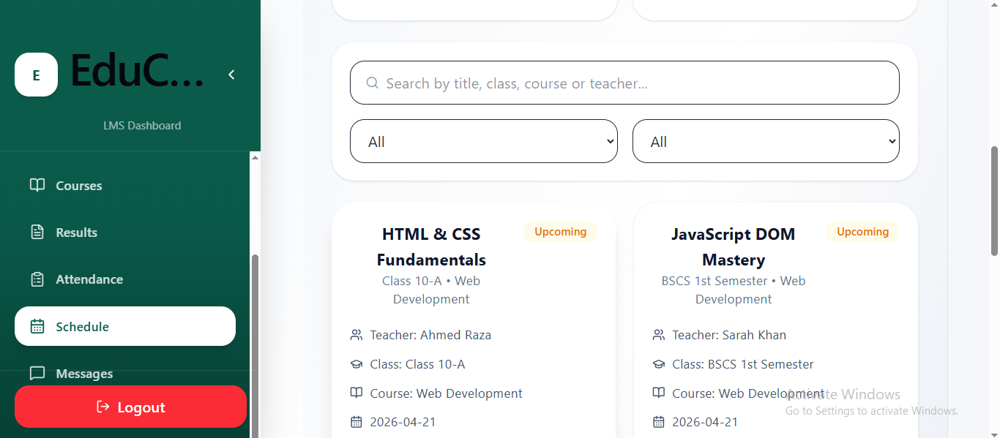
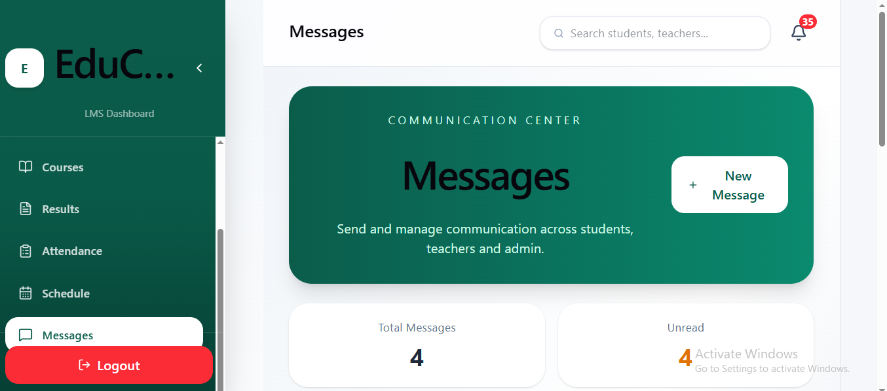
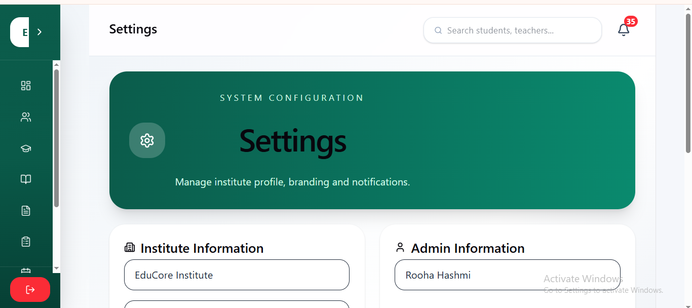

# 🎓 Student LMS Management System

A modern full-stack Student Learning Management System built with React.js, Tailwind CSS, Node.js, Express.js, and REST APIs.

This project is designed as a premium admin dashboard for educational institutes to manage students, teachers, courses, attendance, results, schedules, communication, and system settings from one centralized platform.

---

# 🚀 Features

## 🔐 Authentication
- Secure Login Page
- Signup System
- Admin Access Dashboard

## 📊 Smart Dashboard
- Analytics Overview
- Student & Teacher Statistics
- Attendance Tracking
- Performance Metrics
- Quick Actions
- Report Generation UI

## 👨‍🎓 Student Management
- Add / Edit / Delete Students
- Student Profile Management
- Class & Course Assignment
- Status Tracking
- Student Image Upload
- Search & Filters
- Responsive Student Cards

## 👩‍🏫 Teacher Management
- Add / Edit / Delete Teachers
- Teacher Profiles
- Subject Assignment
- Experience Tracking
- Search & Filters

## 📚 Courses Management
- Course Creation
- Course Categories
- Teacher Assignment
- Student Enrollment
- Status Tracking

## 📝 Results Management
- Add / Edit / Delete Results
- Marks Entry
- Auto Grade Calculation
- Percentage Analytics
- Pass / Fail Logic

## 📅 Attendance Management
- Mark Attendance
- Present / Absent / Late
- Daily Records
- Attendance Analytics

## 🗓 Schedule Management
- Class Scheduling
- Subject Planning
- Teacher Assignment

## 💬 Communication Center
- Messaging Dashboard
- Notifications
- Admin Communication

## ⚙ Settings Panel
- Institute Branding
- Admin Profile
- System Configuration

---

# 🛠 Tech Stack

## Frontend
- React.js
- Tailwind CSS
- React Router DOM
- Lucide React

## Backend
- Node.js
- Express.js
- REST API

## Database
- JSON Server / Local API

---

# 🎨 UI/UX Highlights
- Premium LMS Dashboard
- Fully Responsive Design
- Mobile + Tablet + Desktop Optimized
- Modern Admin Interface
- Professional CRUD UI
- Dashboard Cards
- Advanced Forms & Modals

---

# 📸 Screenshots

## 🔐 Login Page

## 📊 Dashboard

## 👨‍🎓 Students

## 👩‍🏫 Teachers

## 📚 Courses

## 📝 Results

## 📅 Attendance

## 🗓 Schedule

## 💬 Messages

## ⚙ Settings

---

# 📂 Project Structure

student-lms/
├── frontend/
│   ├── src/
│   ├── components/
│   ├── pages/
│   └── api/
├── backend/
├── screenshots/
├── README.md
└── .gitignore

---

# ⚡ Installation

## Clone Repository
git clone https://github.com/yourusername/student-lms-management-system.git

## Open Project
cd student-lms-management-system

## Install Dependencies
npm install

## Run Frontend
npm run dev

## Run Backend
npm start

---

# 🌟 Future Improvements
- Role-Based Authentication
- Parent Portal
- Fee Management
- Assignment System
- Exams Module
- Cloud Upload
- MongoDB / MySQL Integration

---

# 👨‍💻 Author
Roha Hashmi

Frontend Developer | React Developer | LMS Dashboard Builder

---

# 📄 License
Open-source for educational and portfolio use.